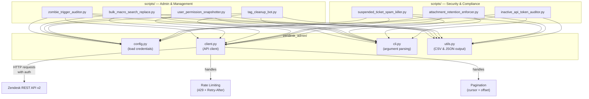
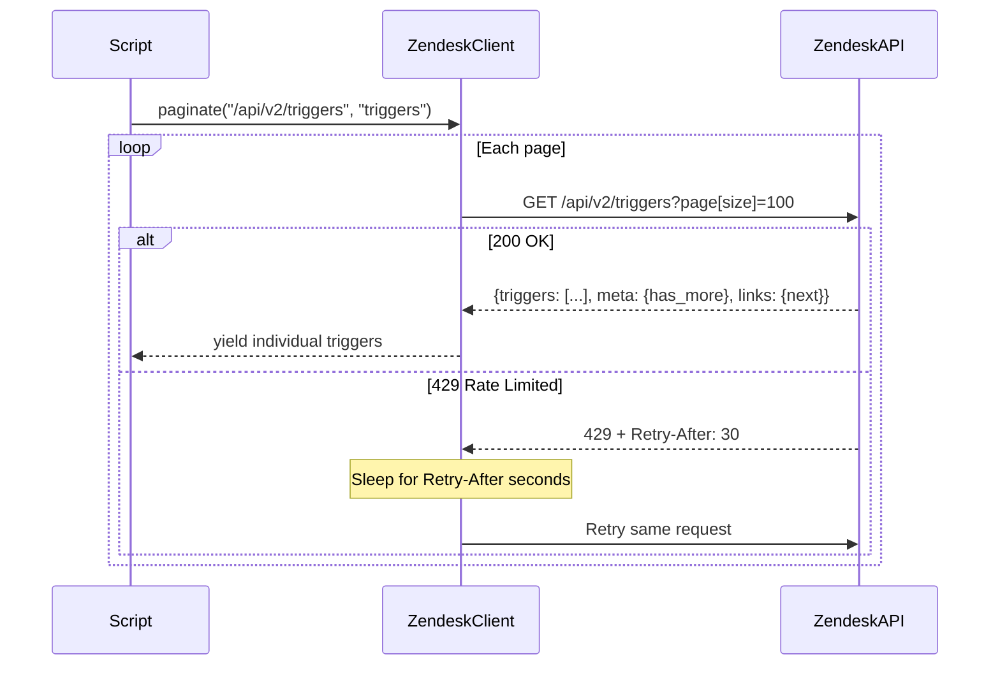
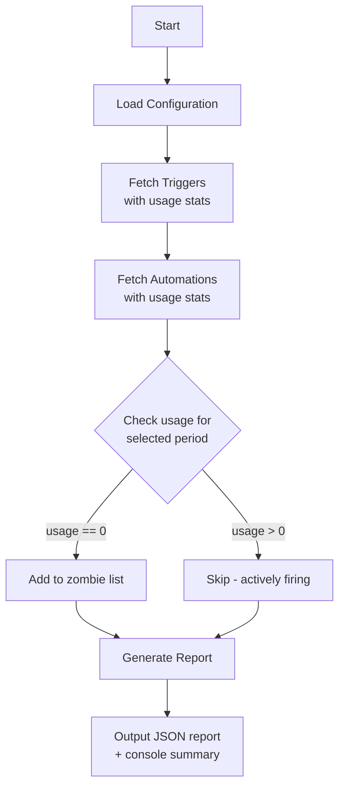
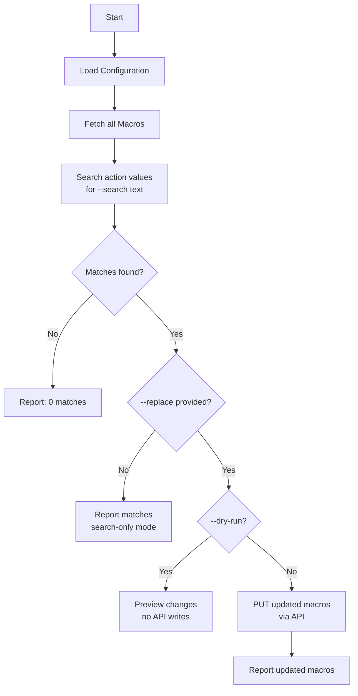
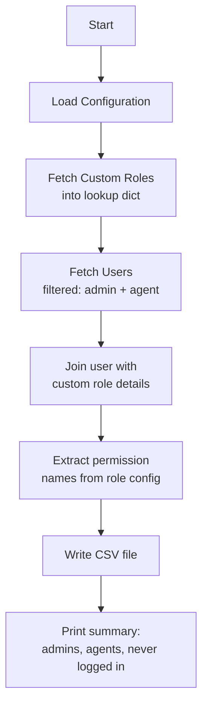
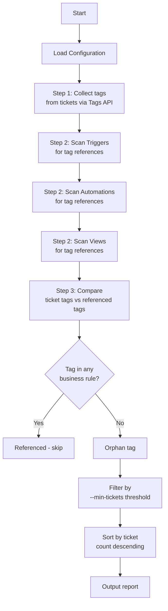
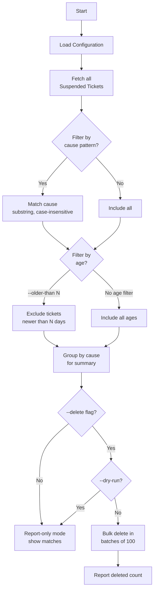
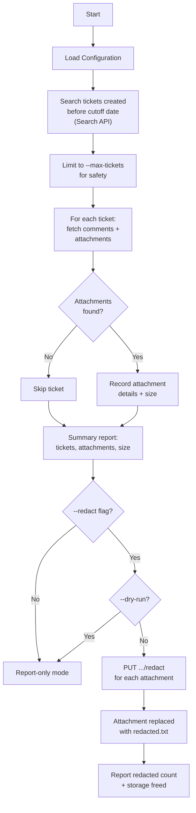
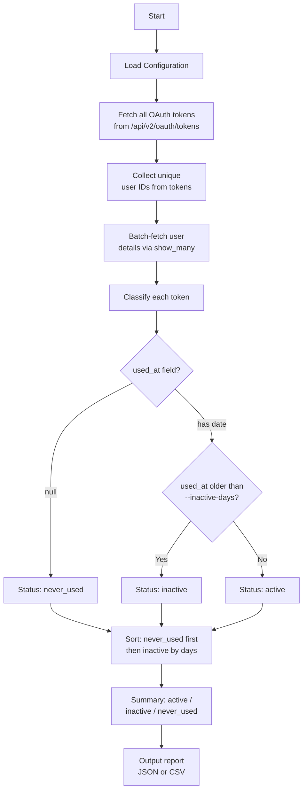

# Zendesk Admin Management Scripts

A modular collection of Python scripts for automating common Zendesk administration tasks. Built for support teams that need to audit, maintain, and bulk-manage their Zendesk instance beyond what the native UI offers.

## Scripts

### Admin & Management

| Script | Purpose |
|--------|---------|
| [Zombie Trigger Auditor](#1-zombie-trigger-auditor) | Find triggers/automations with zero usage |
| [Bulk Macro Search & Replace](#2-bulk-macro-content-search--replace) | Search and replace text across all macros |
| [User Permission Snapshotter](#3-user-permission-snapshotter) | Export admin/agent users to CSV for audits |
| [Tag Cleanup Bot](#4-tag-cleanup-bot) | Identify orphan tags for consolidation |

### Security & Compliance

| Script | Purpose |
|--------|---------|
| [Suspended Ticket Spam-Killer](#5-suspended-ticket-spam-killer) | Bulk-delete suspended tickets by cause pattern |
| [Attachment Retention Enforcer](#6-attachment-retention-enforcer) | Redact attachments from old tickets for privacy/storage |
| [Inactive API Token Auditor](#7-inactive-api-token-auditor) | Find OAuth tokens unused in 30+ days for revocation |

---

## Architecture

All scripts share a common library (`zendesk_admin/`) that handles authentication, API requests, pagination, and rate limiting. This makes it easy to add new scripts without duplicating boilerplate.



### Request Flow



---

## Quick Start

### Prerequisites

- Python 3.9+
- A Zendesk account with **Admin** access
- An API token (Admin Center → Apps and Integrations → APIs → Zendesk API)

### Installation

```bash
# Clone the repository
git clone https://github.com/mohdasim/Zendesk-Admin-Management-Scripts.git
cd Zendesk-Admin-Management-Scripts

# Install dependencies
pip install -r requirements.txt

# Configure credentials
cp .env.example .env
# Edit .env with your Zendesk subdomain, email, and API token
```

### Configuration

Edit the `.env` file with your Zendesk credentials:

```env
ZENDESK_SUBDOMAIN=yourcompany        # yourcompany.zendesk.com
ZENDESK_EMAIL=admin@yourcompany.com  # Admin email address
ZENDESK_API_TOKEN=your_api_token     # From Admin Center
```

All scripts read credentials from the `.env` file by default. Use `--env-file` to specify a different path.

---

## Script Details

### 1. Zombie Trigger Auditor

Identifies triggers and automations with **zero usage** over a configurable time period. Uses Zendesk's built-in usage statistics (`usage_1h`, `usage_24h`, `usage_7d`, `usage_30d`) for accurate detection.



#### Usage

```bash
# Find triggers/automations with zero usage in the last 7 days (default)
python -m scripts.zombie_trigger_auditor

# Check for zero usage in the last 30 days
python -m scripts.zombie_trigger_auditor --period 30d

# Include disabled triggers in the report
python -m scripts.zombie_trigger_auditor --include-inactive

# Save report to file
python -m scripts.zombie_trigger_auditor --period 30d -o zombies.json

# Enable debug logging
python -m scripts.zombie_trigger_auditor -v
```

#### Options

| Flag | Default | Description |
|------|---------|-------------|
| `--period` | `7d` | Usage period: `1h`, `24h`, `7d`, or `30d` |
| `--include-inactive` | off | Include disabled triggers/automations |
| `--output`, `-o` | stdout | Save JSON report to file |
| `--verbose`, `-v` | off | Enable debug logging |
| `--env-file` | `.env` | Path to credentials file |

#### Sample Output

```
Auditing triggers and automations with zero usage in the last 7 days...

Found 3 zombie items (zero usage in 7 days):
  - Triggers: 2
  - Automations: 1

Type         ID                   Active   Title
--------------------------------------------------------------------------------
trigger      39147977549975       True     Auto-Close Walmart Notifications
trigger      25960167241239       True     Close Ticket
automation   21290448620695       True     Resolve stale pending tickets
```

---

### 2. Bulk Macro Content Search & Replace

Searches for specific text or URLs across all macro action values and optionally replaces them. Supports **dry-run mode** for safe previewing before making changes.



#### Usage

```bash
# Search only - find macros containing a URL
python -m scripts.bulk_macro_search_replace --search "help.oldcompany.com"

# Preview replacements (dry run)
python -m scripts.bulk_macro_search_replace \
  --search "help.oldcompany.com" \
  --replace "help.newcompany.com" \
  --dry-run

# Apply replacements
python -m scripts.bulk_macro_search_replace \
  --search "help.oldcompany.com" \
  --replace "help.newcompany.com"

# Save match report to file
python -m scripts.bulk_macro_search_replace --search "old-brand" -o matches.json
```

#### Options

| Flag | Default | Description |
|------|---------|-------------|
| `--search`, `-s` | *(required)* | Text or URL to find in macros |
| `--replace`, `-r` | *(none)* | Replacement text (omit for search-only) |
| `--dry-run` | off | Preview changes without applying |
| `--output`, `-o` | stdout | Save match report to JSON file |
| `--verbose`, `-v` | off | Enable debug logging |
| `--env-file` | `.env` | Path to credentials file |

---

### 3. User Permission Snapshotter

Exports a CSV of all **Admin** and **Agent** users with their last login date, custom role name, and permissions. Designed for monthly security audits.



#### Usage

```bash
# Export to default file (user_permissions_snapshot.csv)
python -m scripts.user_permission_snapshotter

# Export to custom file path
python -m scripts.user_permission_snapshotter -o audit_march_2026.csv
```

#### Options

| Flag | Default | Description |
|------|---------|-------------|
| `--output`, `-o` | `user_permissions_snapshot.csv` | Output CSV file path |
| `--verbose`, `-v` | off | Enable debug logging |
| `--env-file` | `.env` | Path to credentials file |

#### CSV Columns

| Column | Description |
|--------|-------------|
| `id` | Zendesk user ID |
| `name` | Full name |
| `email` | Email address |
| `role` | `admin` or `agent` |
| `custom_role_id` | Custom role ID (Enterprise+) |
| `custom_role_name` | Custom role name |
| `custom_role_permissions` | Semicolon-separated list of enabled permissions |
| `last_login_at` | Last login timestamp (ISO 8601) |
| `two_factor_auth_enabled` | Whether 2FA is enabled |
| `active` | Whether the user is active |
| `suspended` | Whether the user is suspended |
| `created_at` | Account creation date |
| `updated_at` | Last profile update date |

---

### 4. Tag Cleanup Bot

Identifies **orphan tags** -- tags that exist on tickets but are not referenced in any Trigger, Automation, or View. Generates a report for tag consolidation.



#### Usage

```bash
# Find all orphan tags
python -m scripts.tag_cleanup_bot

# Only report orphan tags on 5+ tickets
python -m scripts.tag_cleanup_bot --min-tickets 5

# Save report to file
python -m scripts.tag_cleanup_bot -o orphan_tags.json

# Verbose output to see API calls
python -m scripts.tag_cleanup_bot -v
```

#### Options

| Flag | Default | Description |
|------|---------|-------------|
| `--min-tickets` | `1` | Minimum ticket count to include in report |
| `--output`, `-o` | stdout | Save JSON report to file |
| `--verbose`, `-v` | off | Enable debug logging |
| `--env-file` | `.env` | Path to credentials file |

#### Sample Output

```
Step 1: Collecting tags from tickets...
  Found 342 tags on tickets

Step 2: Scanning business rules for tag references...
  Scanned 21 triggers
  Scanned 5 automations
  Scanned 15 views

  Total unique tags referenced in business rules: 28

Step 3: Identifying orphan tags...

Results:
  Tags on tickets:              342
  Tags in business rules:       28
  Orphan tags (>= 1 tickets):   314

Tag                                      Ticket Count
------------------------------------------------------
legacy_import                                     1847
old_category_electronics                           523
temp_migration_batch2                              201
...
```

---

## Security & Compliance Scripts

### 5. Suspended Ticket Spam-Killer

Bulk-deletes suspended tickets based on specific **cause patterns** (e.g., "Detected as spam", "Automated response mail") to keep the suspended queue manageable. Operates in **report-only mode** by default — requires `--delete` flag to actually remove tickets.



#### Usage

```bash
# List all suspended tickets (report only)
python -m scripts.suspended_ticket_spam_killer

# List suspended tickets matching specific causes
python -m scripts.suspended_ticket_spam_killer --causes "Detected as spam"

# Multiple cause patterns + age filter
python -m scripts.suspended_ticket_spam_killer \
  --causes "Detected as spam" "Automated response mail" \
  --older-than 30

# Preview deletions (dry run)
python -m scripts.suspended_ticket_spam_killer \
  --causes "Detected as spam" --delete --dry-run

# Actually delete matched tickets
python -m scripts.suspended_ticket_spam_killer \
  --causes "Detected as spam" --older-than 60 --delete

# Save report to file
python -m scripts.suspended_ticket_spam_killer --causes "Detected as spam" -o spam_report.json
```

#### Options

| Flag | Default | Description |
|------|---------|-------------|
| `--causes`, `-c` | *(all)* | Cause patterns to match (case-insensitive substring) |
| `--older-than` | *(none)* | Only target tickets older than N days |
| `--delete` | off | Actually delete matched tickets |
| `--dry-run` | off | Preview deletions (same as omitting `--delete`) |
| `--output`, `-o` | stdout | Save match report to JSON file |
| `--verbose`, `-v` | off | Enable debug logging |
| `--env-file` | `.env` | Path to credentials file |

#### Sample Output

```
Scanning suspended tickets (causes matching: 'Detected as spam', older than 30 days)...

Found 47 matching suspended ticket(s):
  - Detected as spam: 42
  - Detected as spam by Zendesk: 5

ID                   Created                Cause                          Subject
----------------------------------------------------------------------------------------------------
8234567890123        2026-01-15             Detected as spam               Win a free iPhone!!!
8234567890456        2026-01-20             Detected as spam               Urgent business proposal
  ... and 45 more

[REPORT-ONLY MODE] No tickets deleted.
Use --delete to permanently remove these tickets.
```

---

### 6. Attachment Retention Enforcer

Identifies tickets older than a configurable number of years and **redacts attachments** while preserving conversation text. Zendesk replaces redacted attachments with an empty `redacted.txt` file. Helps manage storage costs and comply with data retention/privacy policies (e.g., GDPR).

**WARNING: Redaction is PERMANENT and cannot be undone.**



#### Usage

```bash
# Report attachments on tickets older than 2 years (report only)
python -m scripts.attachment_retention_enforcer --older-than-years 2

# Filter to closed tickets only
python -m scripts.attachment_retention_enforcer --older-than-years 2 --status closed

# Preview redaction (dry run)
python -m scripts.attachment_retention_enforcer --older-than-years 3 --redact --dry-run

# Actually redact attachments (PERMANENT)
python -m scripts.attachment_retention_enforcer --older-than-years 3 --status closed --redact

# Process more tickets (default limit: 100)
python -m scripts.attachment_retention_enforcer --older-than-years 2 --max-tickets 500

# Save attachment report to file
python -m scripts.attachment_retention_enforcer --older-than-years 2 -o attachments.json
```

#### Options

| Flag | Default | Description |
|------|---------|-------------|
| `--older-than-years` | *(required)* | Target tickets created more than N years ago |
| `--status` | *(all)* | Filter by ticket status: new/open/pending/hold/solved/closed |
| `--redact` | off | Actually redact attachments (permanent!) |
| `--dry-run` | off | Preview redactions (same as omitting `--redact`) |
| `--max-tickets` | `100` | Max tickets to process per run (safety limit) |
| `--output`, `-o` | stdout | Save attachment report to JSON file |
| `--verbose`, `-v` | off | Enable debug logging |
| `--env-file` | `.env` | Path to credentials file |

#### Sample Output

```
Searching for tickets created before 2024-03-31 with status 'closed'...
Found 234 ticket(s) matching criteria.
Limiting to first 100 tickets (use --max-tickets to adjust).

Scanning 100 ticket(s) for attachments...
  Scanned 20/100 tickets (45 attachments found)
  Scanned 40/100 tickets (89 attachments found)
  Scanned 100/100 tickets (156 attachments found)

Results:
  Tickets scanned:           100
  Tickets with attachments:  67
  Total attachments found:   156
  Total attachment size:     487.3 MB

Ticket       Attachment          Size  File Name
---------------------------------------------------------------------------
12345        99001            2.3 MB  invoice_scan.pdf
12345        99002          512.0 KB  receipt.jpg
12890        99155           15.7 MB  debug_log.zip
  ... and 153 more (see full report with -o)

[REPORT-ONLY MODE] No attachments redacted.
Use --redact to permanently redact these attachments.
```

---

### 7. Inactive API Token Auditor

Lists all **OAuth access tokens** and highlights those that haven't been used within a configurable number of days, alerting the admin to revoke them for security. Cross-references token owners with user details for context.



#### Usage

```bash
# Audit tokens with default 30-day inactivity threshold
python -m scripts.inactive_api_token_auditor

# Custom inactivity threshold (90 days)
python -m scripts.inactive_api_token_auditor --inactive-days 90

# Export as CSV
python -m scripts.inactive_api_token_auditor --format csv -o token_audit.csv

# Export as JSON
python -m scripts.inactive_api_token_auditor -o token_audit.json
```

#### Options

| Flag | Default | Description |
|------|---------|-------------|
| `--inactive-days` | `30` | Mark tokens inactive if unused for N days |
| `--format` | `json` | Output format: `json` or `csv` |
| `--output`, `-o` | stdout | Save report to file |
| `--verbose`, `-v` | off | Enable debug logging |
| `--env-file` | `.env` | Path to credentials file |

#### Sample Output

```
Fetching OAuth tokens...
Found 12 OAuth token(s).
Fetching details for 8 token owner(s)...

Token Audit Summary (inactive threshold: 30 days):
  Total tokens:    12
  Active:          7
  Inactive:        3
  Never used:      2

Tokens requiring attention (5):
ID           Status        Last Used      Days   User                      Scopes
-----------------------------------------------------------------------------------------------
44012        never_used    never          N/A    dev-bot@company.com       read, write
44018        never_used    never          N/A    test@company.com          read
44005        inactive      2026-01-15     75     old-integration@co.com    read, write
44009        inactive      2026-02-01     58     api-user@company.com      read
44011        inactive      2026-02-20     39     reports@company.com       read

Recommendation: Review and revoke inactive/unused tokens in
Admin Center > Apps and Integrations > APIs > OAuth Tokens
```

---

## Adding a New Script

The project is designed for easy extension. To add a new script:

1. **Create a new file** in `scripts/`:

```python
#!/usr/bin/env python3
"""Description of your new script."""

import sys
from pathlib import Path

sys.path.insert(0, str(Path(__file__).resolve().parent.parent))

from zendesk_admin import ZendeskClient, load_config
from zendesk_admin.cli import base_parser, setup_logging
from zendesk_admin.utils import print_json_report  # or write_csv


def main():
    parser = base_parser("Your Script Description")
    # Add script-specific arguments
    parser.add_argument("--your-flag", help="...")

    args = parser.parse_args()
    setup_logging(args.verbose)

    config = load_config(args.env_file)
    client = ZendeskClient(config)

    # Use client.get(), client.put(), or client.paginate()
    for item in client.paginate("/api/v2/endpoint", "items"):
        # Process items
        pass


if __name__ == "__main__":
    main()
```

2. **Run it**:
```bash
python -m scripts.your_new_script --help
```

The shared `ZendeskClient` handles authentication, pagination, and rate limiting automatically.

### Available Client Methods

| Method | Description |
|--------|-------------|
| `client.get(endpoint, params)` | GET request, returns JSON dict |
| `client.put(endpoint, json)` | PUT request, returns JSON dict |
| `client.delete(endpoint, params)` | DELETE request, returns JSON dict or None (204) |
| `client.paginate(endpoint, key, params)` | Yields individual records from paginated endpoint |

---

## API Rate Limits

Zendesk enforces rate limits on API usage. The `ZendeskClient` handles this automatically:

- **Detection**: Monitors for HTTP `429 Too Many Requests` responses
- **Backoff**: Waits for the duration specified in the `Retry-After` header
- **Retry**: Retries up to 5 times before raising a `RateLimitError`
- **Pagination**: Uses cursor-based pagination (preferred) with offset fallback

### Rate Limit Guidelines

| Plan | Limit |
|------|-------|
| Team | 200 requests/minute |
| Professional | 400 requests/minute |
| Enterprise | 700 requests/minute |

For large Zendesk instances, consider running scripts during off-peak hours.

---

## Limitations

### Zombie Trigger Auditor
- Usage statistics (`usage_1h`, `usage_24h`, `usage_7d`, `usage_30d`) are provided by Zendesk and may not be available on all plan tiers.
- The `usage_30d` field only covers the last 30 days. A trigger that fires once every 60 days would still appear as a zombie.
- Automations may not support the `include=usage_*` parameter on all Zendesk plans.

### Bulk Macro Search & Replace
- Searches action values only (not macro titles or descriptions).
- Macro action values can be strings, lists of strings, or nested structures. The script handles strings and lists but not deeply nested structures.
- No undo mechanism. Always use `--dry-run` first and keep backups.

### User Permission Snapshotter
- Custom roles and their permissions require an **Enterprise+** plan. On lower plans, the `custom_role_name` and `custom_role_permissions` columns will be empty.
- The `role[]` filter fetches admins and agents only. End-users are excluded by design.
- The `two_factor_auth_enabled` field may not be available on all plans.

### Tag Cleanup Bot
- The Tags API returns **up to 20,000 most popular tags from the last 60 days**. Rarely-used tags or tags older than 60 days may not appear.
- Tags referenced only in **Macros** or **SLA policies** are not checked (only Triggers, Automations, and Views are scanned).
- Tag names are compared as exact strings (case-sensitive).

### Suspended Ticket Spam-Killer
- Bulk delete is limited to **100 ticket IDs per API request** (handled automatically in batches).
- Deletion is **permanent** — suspended tickets cannot be recovered after deletion.
- The `cause` field is matched as a case-insensitive substring. Partial matches may capture unintended tickets — always review in report-only mode first.
- Only Admins or custom-role agents with suspended ticket permissions can access this endpoint.

### Attachment Retention Enforcer
- Redaction is **permanent and cannot be undone**. Zendesk replaces the attachment with an empty `redacted.txt` file.
- Cannot redact attachments on **closed tickets** on some Zendesk plans. The script logs warnings for failed redactions.
- Uses the Zendesk Search API, which has its own rate limits and may return incomplete results for very large instances.
- The `--max-tickets` safety limit defaults to 100 per run to prevent accidental mass redaction.
- File size reported is from Zendesk metadata — actual storage savings may vary.

### Inactive API Token Auditor
- Audits **OAuth access tokens only**. Generic API tokens created in the Admin Center are **not queryable via the REST API** and will not appear in results.
- The `used_at` field tracks the last time the token was used for an API request. A `null` value means the token was never used.
- This script is **read-only** — it does not revoke tokens. Revocation must be done manually in Admin Center.
- Token scopes and client IDs are shown for context but cannot be modified via this script.

### General
- All scripts require Admin-level API access.
- API token authentication only (OAuth not supported).
- Rate limits vary by Zendesk plan tier (see [Rate Limits](#api-rate-limits)).
- Scripts run synchronously. Large instances with thousands of triggers, macros, or users may take several minutes.

---

## Project Structure

```
Zendesk-Admin-Management-Scripts/
├── .env.example            # Template for credentials
├── .gitignore              # Python, IDE, and output file exclusions
├── LICENSE                 # MIT License
├── README.md               # This file
├── requirements.txt        # Python dependencies
├── zendesk_admin/          # Shared library
│   ├── __init__.py         # Package exports
│   ├── client.py           # ZendeskClient (auth, pagination, rate limiting)
│   ├── cli.py              # Shared CLI argument parser
│   ├── config.py           # Configuration loading from .env
│   └── utils.py            # CSV and JSON output helpers
└── scripts/                # Runnable admin scripts
    ├── __init__.py
    ├── zombie_trigger_auditor.py         # Admin & Management
    ├── bulk_macro_search_replace.py      # Admin & Management
    ├── user_permission_snapshotter.py    # Admin & Management
    ├── tag_cleanup_bot.py                # Admin & Management
    ├── suspended_ticket_spam_killer.py   # Security & Compliance
    ├── attachment_retention_enforcer.py  # Security & Compliance
    └── inactive_api_token_auditor.py     # Security & Compliance
```

---

## License

This project is licensed under the MIT License. See the [LICENSE](LICENSE) file for details.
